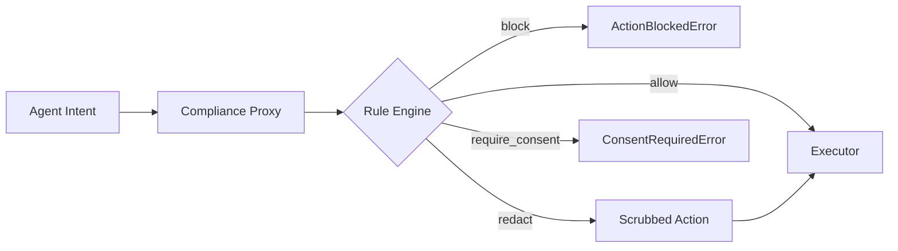

# compliance-firewall

A compliance proxy for autonomous agents. Intercepts intended actions and evaluates them against a rule database, producing **allow**, **block**, **redact**, or **require_consent** decisions before anything executes.

Built for teams deploying AI agents that handle regulated data (GDPR, CCPA, PIPL, etc.).

## Why

Autonomous agents can inadvertently violate privacy and AI regulations — exporting PII to non-adequate third countries, calling tools with sensitive fields, or using data beyond its declared purpose. compliance-firewall sits between the agent and its executors, enforcing policy at the action level.

## Architecture



## Install

```bash
pip install -e ".[dev]"
```

Requires Python 3.11+. Zero runtime dependencies (stdlib only).

## Quick Start

### Check an action against rules

```bash
cf check examples/actions/pii_export_us.json --rules examples/rules.yaml
```

Output:

```
✗ Decision: BLOCK
  Action: data_export
  Destination: US
  Purpose: analytics
  PII: yes (email, name, phone)
  Matched rules (2):
    - [critical] GDPR-ART44 (EU): No PII transfer to non-adequate third countries
      Citation: GDPR Art. 44 — General principle for transfers
    - [critical] CHINA-PIPL-LOCALIZE (CN): PII collected in China must not be exported...
      Citation: PIPL Art. 38
  Remediation:
    → Use an EU-based processor or obtain explicit consent under Art. 49(1)(a).
    → Complete CAC security assessment before cross-border transfer.
```

### Run the local demo

```bash
cf serve-demo
```

Runs three scenarios (block, allow, redact) with no network required.

### Use as a library

```python
from compliance_firewall import Action, ComplianceProxy, load_rules

rules = load_rules("examples/rules.yaml")

def my_executor(action):
    # Real work: HTTP call, DB query, tool invocation
    return {"status": "ok", "payload": action.payload}

proxy = ComplianceProxy(rules=rules, executor=my_executor)

action = Action.from_dict({
    "action_type": "data_export",
    "destination_region": "US",
    "contains_pii": True,
    "data_categories": ["email"],
    "payload": {"email": "user@example.com"},
})

try:
    result = proxy.execute(action)
except Exception as e:
    print(f"Blocked: {e}")
```

## Action Model

Every agent action carries structured metadata:

| Field | Type | Description |
|---|---|---|
| `action_type` | `http_request` \| `db_query` \| `data_export` \| `tool_call` | What the agent wants to do |
| `destination_region` | string | ISO region code (`US`, `EU`, `CN`, ...) |
| `contains_pii` | bool | Whether payload has PII |
| `purpose` | string | Declared purpose (`analytics`, `marketing`, ...) |
| `data_categories` | list[string] | Categories present (`email`, `phone`, ...) |
| `payload` | dict | Arbitrary data; matching keys are scrubbed on redact |
| `actor` | string | Optional agent/user identifier |

## Rule Database

Rules live in YAML or JSON. Each rule has:

```yaml
- id: GDPR-ART44
  jurisdiction: EU
  description: "No PII transfer to non-adequate third countries"
  match:
    contains_pii: true
    destination_regions: [US, CN, RU, IN]
  decision: block          # allow | block | redact | require_consent
  severity: critical       # low | medium | high | critical
  citation: "GDPR Art. 44"
  remediation: "Use an EU-based processor."
  priority: 100
```

When multiple rules match, the most restrictive decision wins: `block > require_consent > redact > allow`.

## Decisions

| Decision | Proxy behavior |
|---|---|
| **allow** | Action passes through to executor unchanged |
| **block** | `ActionBlockedError` raised; executor never called |
| **redact** | PII fields replaced with `[REDACTED]`; scrubbed action executed |
| **require_consent** | `ConsentRequiredError` raised; executor never called |

## Redaction

When a rule fires with `decision: redact`, matching payload fields are replaced with `[REDACTED]`:

- Category-based: `email` → strips `email`, `user_email`, etc.
- Always-on: secrets (`password`, `api_key`, `token`, ...) are always stripped.
- Nested: dicts and lists are traversed recursively.

## CLI Reference

```
cf check <action.json> --rules <rules.yaml> [--verbose]
    Evaluate an action file against a rules file.
    Exit codes: 0=allow, 1=block/consent, 3=redacted, 2=error

cf serve-demo
    Run a self-contained demo with built-in scenarios (no network).
```

## Example Files

- `examples/rules.yaml` — GDPR, CCPA, PIPL, and internal policy rules
- `examples/actions/pii_export_us.json` — PII export to US (blocks)
- `examples/actions/clean_action.json` — Clean HTTP request (allows)
- `examples/actions/tool_call_phone.json` — Tool call with phone (redacts)
- `examples/actions/marketing_email_eu.json` — Marketing email (requires consent)

## Testing

```bash
pytest -v
```

## Extending: Remote Rule Feed

The MVP loads rules from local files. To plug in a remote feed:

```python
import json, urllib.request
from compliance_firewall.rules import load_rules_from_dict

def fetch_rules(url):
    with urllib.request.urlopen(url) as resp:
        return load_rules_from_dict(json.loads(resp.read()))

rules = fetch_rules("https://rules.example.com/api/v1/rules")
```

Any source producing the same dict schema works: HTTP API, S3, database, etc.

## Architecture

See [docs/ARCHITECTURE.md](docs/ARCHITECTURE.md) for full design details.

## License

MIT
