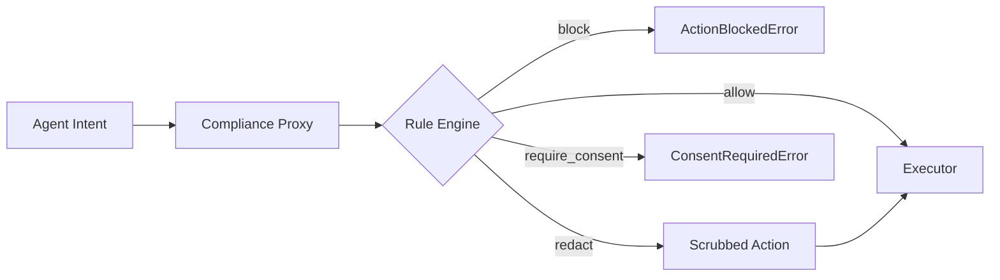

# compliance-firewall

[](https://github.com/medthemed/compliance-firewall/actions/workflows/ci.yml)
[](LICENSE)
[](https://www.python.org/downloads/)

A compliance proxy for autonomous agents. Intercepts intended actions and evaluates them against a rule database, producing **allow**, **block**, **redact**, or **require_consent** decisions before anything executes.

Built for teams deploying AI agents that handle regulated data (GDPR, CCPA, PIPL, etc.).

**Writing rules?** See the [Rule Authoring Guide](docs/RULE_AUTHORING.md).

## Why

Autonomous agents can inadvertently violate privacy and AI regulations — exporting PII to non-adequate third countries, calling tools with sensitive fields, or using data beyond its declared purpose. compliance-firewall sits between the agent and its executors, enforcing policy at the action level.

## Architecture



## Install

```bash
pip install -e ".[dev]"
```

Requires Python 3.11+. Zero runtime dependencies (stdlib only).

## Quick Start

### Check an action against rules

```bash
cf check examples/actions/pii_export_us.json --rules examples/rules.yaml
```

Output:

```
✗ Decision: BLOCK
  Action: data_export
  Source: CN
  Destination: US
  Purpose: analytics
  PII: yes (email, name, phone)
  Matched rules (2):
    * [critical] GDPR-ART44 (EU): No PII transfer to non-adequate third countries
        Citation: GDPR Art. 44 — General principle for transfers
    - [critical] CHINA-PIPL-LOCALIZE (CN): PII collected in China must not be exported...
        Citation: PIPL Art. 38
  Remediation:
    → Use an EU-based processor or obtain explicit consent under Art. 49(1)(a).
    → Complete CAC security assessment before cross-border transfer.
```

Add `--verbose` to see which rule decided the outcome and which softer matches were overridden:

```bash
cf check examples/actions/pii_export_us.json --rules examples/rules.yaml --verbose
```

```
  ...
  Explanation: block by GDPR-ART44 (critical); overridden: CCPA-OPTEVENT (require_consent).
  Deciding rule: GDPR-ART44 → block (critical)
  Overridden rules:
    - CCPA-OPTEVENT proposed require_consent (high)
```

### Run the local demo

```bash
cf serve-demo
```

Runs three scenarios (block, allow, redact) with no network required.

### Use as a library

```python
from compliance_firewall import Action, ComplianceError, ComplianceProxy, load_rules

rules = load_rules("examples/rules.yaml")

def my_executor(action):
    # Real work: HTTP call, DB query, tool invocation
    return {"status": "ok", "payload": action.payload}

proxy = ComplianceProxy(rules=rules, executor=my_executor)

action = Action.from_dict({
    "action_type": "data_export",
    "destination_region": "US",
    "contains_pii": True,
    "data_categories": ["email"],
    "payload": {"email": "user@example.com"},
})

try:
    result = proxy.execute(action)
except ComplianceError as e:
    print(f"Denied ({e.result.decision.value}): {e.result.explain()}")
```

`ActionBlockedError` and `ConsentRequiredError` both subclass `ComplianceError`
and carry the full `DecisionResult` on `.result`, including `deciding_rule`,
`overridden_rules`, and `explain()`.

## Action Model

Every agent action carries structured metadata:

| Field | Type | Description |
|---|---|---|
| `action_type` | `http_request` \| `db_query` \| `data_export` \| `tool_call` | What the agent wants to do |
| `destination_region` | string | ISO region code (`US`, `EU`, `CN`, ...) |
| `source_region` | string | ISO region code where the data was collected (`CN`, `EU`, ...). Empty = unspecified |
| `contains_pii` | bool | Whether payload has PII |
| `purpose` | string | Declared purpose (`analytics`, `marketing`, ...) |
| `data_categories` | list[string] | Categories present (`email`, `phone`, ...) |
| `payload` | dict | Arbitrary data; matching keys are scrubbed on redact |
| `actor` | string | Optional agent/user identifier |

## Rule Database

Rules live in YAML or JSON. Each rule has:

```yaml
- id: GDPR-ART44
  jurisdiction: EU
  description: "No PII transfer to non-adequate third countries"
  match:
    contains_pii: true
    destination_regions: [US, CN, RU, IN]
  decision: block          # allow | block | redact | require_consent
  severity: critical       # low | medium | high | critical
  citation: "GDPR Art. 44"
  remediation: "Use an EU-based processor."
  priority: 100
```

Origin-based rules can also filter on `source_regions`, which matches the
`source_region` field of the action. This is how laws such as PIPL are scoped
to data collected in a particular jurisdiction:

```yaml
- id: CHINA-PIPL-LOCALIZE
  jurisdiction: CN
  description: "PII collected in China must not be exported to non-local processors"
  match:
    source_regions: [CN]
    destination_regions: [US]
    contains_pii: true
  decision: block
  severity: critical
  citation: "PIPL Art. 38"
  priority: 90
```

When multiple rules match, the most restrictive decision wins: `block > require_consent > redact > allow`.

## Decisions

| Decision | Proxy behavior |
|---|---|
| **allow** | Action passes through to executor unchanged |
| **block** | `ActionBlockedError` raised; executor never called |
| **redact** | PII fields replaced with `[REDACTED]`; scrubbed action executed |
| **require_consent** | `ConsentRequiredError` raised; executor never called |

### Decision explanations

`DecisionResult` records *how* the outcome was reached:

- `deciding_rule` — the matched rule whose decision won (highest priority among the most restrictive)
- `overridden_rules` — matched rules that proposed a softer decision
- `explain()` — one-line summary, e.g. `block by GDPR-ART44 (critical); overridden: CCPA-OPTEVENT (require_consent).`

When no rules match, `deciding_rule` is `None` and `explain()` returns
`No rules matched; action allowed.`

## Redaction

When a rule fires with `decision: redact`, matching payload fields are replaced with `[REDACTED]`:

- Category-based: `email` → strips `email`, `user_email`, etc.
- Always-on: secrets (`password`, `api_key`, `token`, ...) are always stripped.
- Nested: dicts and lists are traversed recursively.

## CLI Reference

```
cf check <action.json> [--rules <rules.yaml>] [--config <cf.toml>]
         [--severity-threshold low|medium|high|critical] [--verbose]
         [--format text|json]
    Evaluate an action file against a rules file.
    Exit codes: 0=allow, 1=block/consent, 3=redacted, 2=error
    --verbose prints the deciding rule, overridden matches, and a one-line
    explanation.
    --rules is optional when cf.toml or CF_RULES_PATH supplies a default.
    --format json emits a stable machine-readable object for CI (see below).

cf check-batch <actions-dir> [--rules <rules.yaml>] [--config <cf.toml>]
               [--severity-threshold low|medium|high|critical] [--verbose]
               [--format text|json]
    Evaluate every *.json action file in a directory (non-recursive, sorted
    by filename). Prints one result block per file, then a summary grouped
    by decision. Individual parse failures are reported and the batch
    continues; the process still exits 2 when any file fails to parse.
    Exit codes:
      0  every action evaluated to allow
      1  at least one action is block or require_consent
      3  at least one action is redact, and none are block/consent
      2  config/rules error, empty or missing directory, or any parse failure
    Most restrictive overall outcome wins (block/consent > redact > allow).

cf serve-demo
    Run a self-contained demo with built-in scenarios (no network).
```

### Batch example

```bash
cf check-batch examples/actions --rules examples/rules.yaml
```

```
--- clean_action.json ---
✓ Decision: ALLOW
  ...
--- marketing_email_eu.json ---
⚠ Decision: REQUIRE_CONSENT
  ...
--- pii_export_us.json ---
✗ Decision: BLOCK
  ...
========================================
  Batch summary
========================================
  Total files: 5
  allow: 1
  block: 2
  redact: 1
  require_consent: 1
```

Exit code would be `1` because at least one action was blocked.

### Machine-readable output

`--format json` emits a single JSON object on stdout. Exit codes are
unchanged. Errors that normally go to stderr appear as an `error` field.

```bash
cf check examples/actions/pii_export_us.json --rules examples/rules.yaml --format json
```

```json
{
  "schema_version": 1,
  "command": "check",
  "exit_code": 1,
  "decision": "block",
  "action_file": "examples/actions/pii_export_us.json",
  "action": { "action_type": "data_export", "contains_pii": true },
  "result": {
    "decision": "block",
    "explanation": "block by GDPR-ART44 (critical); overridden: CCPA-OPTEVENT (require_consent).",
    "matched_rules": [],
    "deciding_rule": "GDPR-ART44",
    "overridden_rules": ["CCPA-OPTEVENT"],
    "remediation_hints": ["Use an EU-based processor or obtain explicit consent under Art. 49(1)(a)."],
    "redacted_payload": null
  }
}
```

`cf check-batch --format json` wraps the same per-file results with a summary:

```json
{
  "schema_version": 1,
  "command": "check-batch",
  "exit_code": 1,
  "directory": "examples/actions",
  "summary": {"total": 5, "allow": 1, "block": 2, "redact": 1, "require_consent": 1, "errors": 0},
  "results": [
    {"action_file": "clean_action.json", "decision": "allow", "exit_code": 0, "result": {}}
  ]
}
```

`schema_version` is an integer. Additive fields may appear without a bump;
breaking changes increment it.

## JSON Schema

Draft-07 schemas for action files and rule databases ship with the project:

- [`schemas/action.schema.json`](schemas/action.schema.json)
- [`schemas/rules.schema.json`](schemas/rules.schema.json)

```python
from compliance_firewall import (
    ACTION_SCHEMA,
    RULES_SCHEMA,
    schema_path,
    validate_action_data,
    validate_rules_data,
)

# Documents for external validators (jsonschema, check-jsonschema, IDEs)
print(ACTION_SCHEMA["$id"])
print(schema_path("action"))  # filesystem path to the packaged schema

# Lightweight stdlib validation (no jsonschema dependency)
errors = validate_action_data({"action_type": "http_request"})
assert errors == []
```

Validate a file with an external tool:

```bash
check-jsonschema --schemafile schemas/action.schema.json examples/actions/pii_export_us.json
```

## Configuration

Project defaults can live in `cf.toml` (or `.cf.toml` / `compliance-firewall.toml`)
in the working directory, or be pointed at with `--config`:

```toml
rules_path = "examples/rules.yaml"
severity_threshold = "high"   # optional: drop rules below this severity
```

Environment variables:

| Variable | Effect |
|---|---|
| `CF_RULES_PATH` | Default rules file |
| `CF_SEVERITY_THRESHOLD` | Minimum rule severity (`low`/`medium`/`high`/`critical`) |
| `CF_CONFIG` | Path to a config file |

Precedence (highest wins): CLI flags → environment variables → config file → none.
`severity_threshold` filters rules out of evaluation entirely, which is useful
for local experiments where you only care about high/critical findings.

See [examples/cf.toml](examples/cf.toml) for a starter file.

## Example Files

- `examples/rules.yaml` — GDPR, CCPA, PIPL, and internal policy rules
- `examples/actions/pii_export_us.json` — PII collected in CN, exported to US (blocks)
- `examples/actions/pii_export_us_eu_origin.json` — PII collected in EU, exported to US (blocks via GDPR only)
- `examples/actions/clean_action.json` — Clean HTTP request (allows)
- `examples/actions/tool_call_phone.json` — Tool call with phone (redacts)
- `examples/actions/marketing_email_eu.json` — Marketing email (requires consent)

## Testing

```bash
pytest -v
```

## Extending: Remote Rule Feed

The MVP loads rules from local files. To plug in a remote feed:

```python
import json, urllib.request
from compliance_firewall.rules import load_rules_from_dict

def fetch_rules(url):
    with urllib.request.urlopen(url) as resp:
        return load_rules_from_dict(json.loads(resp.read()))

rules = fetch_rules("https://rules.example.com/api/v1/rules")
```

Any source producing the same dict schema works: HTTP API, S3, database, etc.

## Architecture

See [docs/ARCHITECTURE.md](docs/ARCHITECTURE.md) for full design details.

## Writing rules

See [docs/RULE_AUTHORING.md](docs/RULE_AUTHORING.md) for a field-by-field guide,
match semantics, decision selection, and common pitfalls.

## License

MIT
